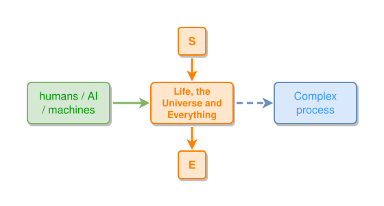

# Life, the Universe and Everything

The graph lives in its own `answer.ipmt` file and is pulled in by the include
line below, so this page renders as the diagram alone -- no ipmt source in the
Markdown, on GitHub or in the preview.

<!-- ipm-include src=./answer.ipmt -->
<!-- ipm-svg id=answer hash=38507bcb -->

