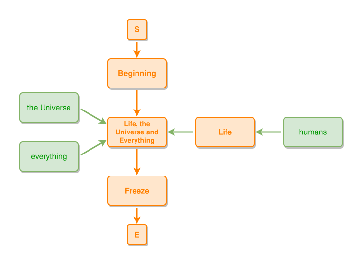

# Life, the Universe and Everything

The graph below is written as an SVG file next to this one, so it renders on
GitHub too.

```ipmt
Beginning ::e
  --> "Life, the Universe and Everything" ::e lue::a
  --> Freeze ::e

Life ::e --::P--> lue
the Universe, everything --> lue
humans --> Life
```
<!-- ipm-svg id=100 hash=a64d7eae -->


Editing the fence re-renders the diagram in the preview immediately -- the SVG
on disk only catches up on save.
